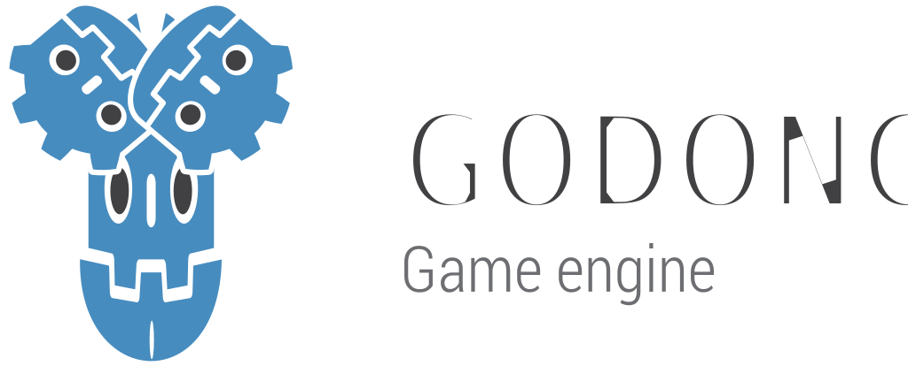

# Godong Engine

  

## 2D and 3D cross-platform game engine

**[Godot Engine](https://godotengine.org)** is the engine behind Godong Engine.
No hate to Godot, they made a great job

## Free, open source and community-driven

Godong is completely free and open source under the very permissive [MIT license](https://godotengine.org/license).
No strings attached, no royalties, nothing. The users' games are theirs, down
to the last line of engine code. Godot's development is fully independent and
community-driven, empowering users to help shape their engine to match their
expectations. It is supported by the [Godot Foundation](https://godot.foundation/)
not-for-profit.

## Getting the original engine

### Binary downloads

Official binaries for the Godot editor and the export templates can be found
[on the Godot website](https://godotengine.org/download).
